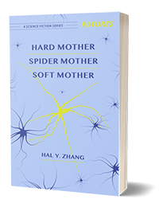

Books
-------

Poetry chapbook <a href="https://newfound.org/catalog/"><em>AMNESIA</em></a> coming this August from Newfound.

Poetry + one short story collection <a href="http://www.aqueductpress.com/forthcoming-pubs.php"><em>Goddess Bandit of the Thousand Arms</em></a> coming soon from Aqueduct Press.

Want to get a sneak peek? [Drop me a line.](about)

  
Chapbook <a href="https://radixmedia.org/product/hard-mother-by-hal-y-zhang/"><em>Hard Mother, Spider Mother, Soft Mother</em></a> is available from Radix Media.

  

What people said:

"In this unexpected sci-fi tale, set in a not-too-futuristic surveillance state, Hal Y. Zhang renders Chinese mother-daughter relationships with tenderness and empathy." ---Ling Ma, author of _Severance_

"An optimistically melancholic look at mental illness, consumerism, and how the two can come between our relationships." ---Joshua Ryan Bligh, <a href="https://independentbookreview.com/2020/03/05/hard-mother-spider-mother-soft-mother/">Independent Book Review</a>