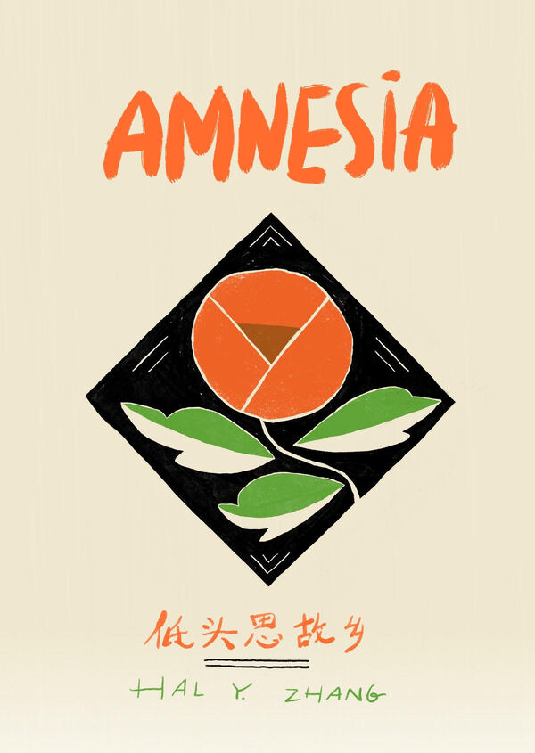
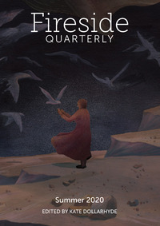

Hi! I make weird stuff. Here's what's happening recently:
----------

My debut full-length poetry (+ one short story) collection, <em>Goddess Bandit of the Thousand Arms</em> is out! You can preview and order from <a href="http://www.aqueductpress.com/books/978-1-61976-189-6.php">Aqueduct Press</a>.

My debut poetry chapbook <em>AMNESIA</em>, on fragmented identity and forgetting a language, is out from <a href="https://newfound.org/product-category/print/chapbooks/poetry/hal-y-zhang/">Newfound</a>.

The anthology <em>Recognizing Fascism</em>, featuring my story "Chicken Time", is out from <a href="https://www.worldweaverpress.com/store/p171/Recognize_Fascism.html">World Weaver Press</a>.

My Python-code-as-story "synthia.py" is out from <a href="https://firesidefiction.com/">Fireside&rsquo;s print edition</a>.

