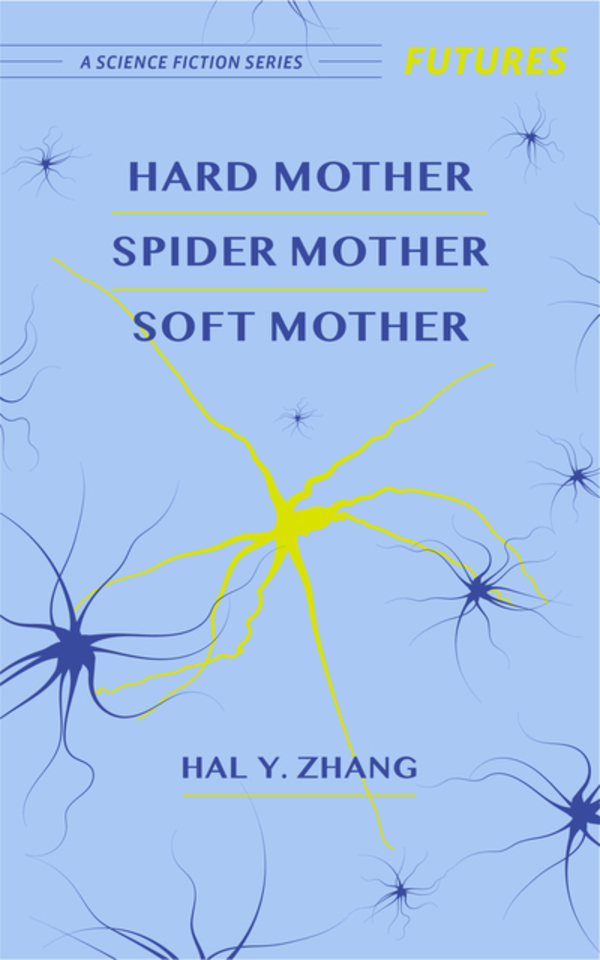

[Books](books) | Hard Mother, Spider Mother, Soft Mother
-------

Ellery thought she knew Valerie, until she didn't. A small book about the sharp things between mothers and daughters.

- **[Order from Radix Media](https://radixmedia.org/product/hard-mother-by-hal-y-zhang/)**
- [Read an excerpt](https://curiousfictions.com/stories/3070-hal-y-zhang-excerpt-from-hard-mother-spider-mother-soft-mother)
- [Read my interview](https://radixmedia.org/memory-holes-conversation-hal-y-zhang/)

 
What people said:

In this unexpected sci-fi tale, set in a not-too-futuristic surveillance state, Hal Y. Zhang renders Chinese mother-daughter relationships with tenderness and empathy. ---Ling Ma, author of _Severance_

An optimistically melancholic look at mental illness, consumerism, and how the two can come between our relationships. ---Joshua Ryan Bligh, <a href="https://independentbookreview.com/2020/03/05/hard-mother-spider-mother-soft-mother/">Independent Book Review</a>
